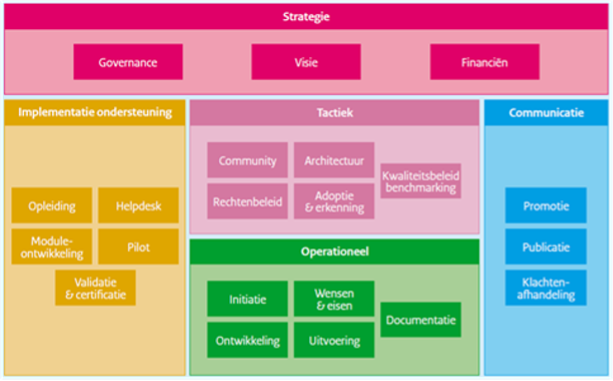

# Inleiding

## Leeswijzer

Dit document beschrijft hoe Logius, afdeling Standaarden
(Uitvoeringsorganisatie), BOMOS beheert en hoe de bijbehorende
governance is ingericht.

## BOMOS versie 2 naar versie 3

BOMOS staat voor 'Beheer en Ontwikkelmodel Open Standaarden. De
methodiek is ontstaan uit een samenwerking met verschillende partijen
met expertise m.b.t. het open beheren van standaarden. In 2006 heeft de
Werkgroep CMO (Community Model Open Standaarden), een werkgroep
bestaande uit TNO, Bureau Forum Standaardisatie en Logius aan dit
onderwerp gewerkt, dit vormde het startpunt voor de ontwikkeling van
BOMOS versie 1 en 2. De methodiek is sindsdien ondergebracht bij Logius
en is toe aan een nieuwe versie. Daarnaast is er behoefte aan tooling
(op basis van BOMOS) ter ondersteuning van het beheren van stelsels en
standaarden. Logius beheerd stelsels en **standaarden** met behulp van

BOMOS maar de methodiek zelf wordt momenteel niet actief beheerd. Om de
methodiek conform BOMOS actief te beheren en door te ontwikkelen zijn we
recent gestart met een werkgroep en het schrijven van dit
beheerdocument.

## Nut

Het nut en de werking van de standaard zijn reeds goed beschreven in
BOMOS versie 2.

Met BOMOS worden standaardisatiecommunities ondersteund en geïnspireerd
bij het structureel vormgeven van het beheer en verdere ontwikkelingen
van standaarden.

### Werking

Het doel is en blijft een duurzame standaard die een bijdrage levert in
interoperabiliteit. Duurzaam kan alleen als het ontwikkel- en
beheerproces op een kwalitatief hoogstaand niveau is ingericht. Dit
document levert een bijdrage om de ontwikkeling en beheer van de
standaard op een hoger plan te krijgen en daarmee duurzame standaarden
en Stelsels te realiseren. Uiteraard is een duurzame standaard een open
standaard die duurzaam beheerd wordt.

### Status

De actuele versie van BOMOS 2.0 is op te vinden op xxx door xxx
vastgesteld.

Concept versie BOMOS 3.0 moet nog worden vastgesteld.

De laatste concept versie 3.0 BOMOS is gepubliceerd in twee delen: [BOMOS Fundament](https://gitdocumentatie.logius.nl/publicatie/bomos/fundament/) en [BOMOS Verdieping](https://gitdocumentatie.logius.nl/publicatie/bomos/verdieping/)

## Bomos

Logius richt de beheerorganisatie in conform het Beheer en
OntwikkelModel voor Open Standaarden (BOMOS). Ook dit beheer document is
op basis van BOMOS ingericht.

