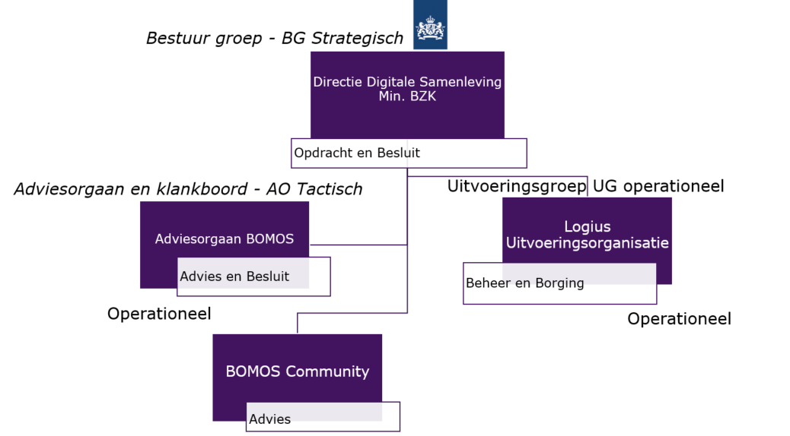
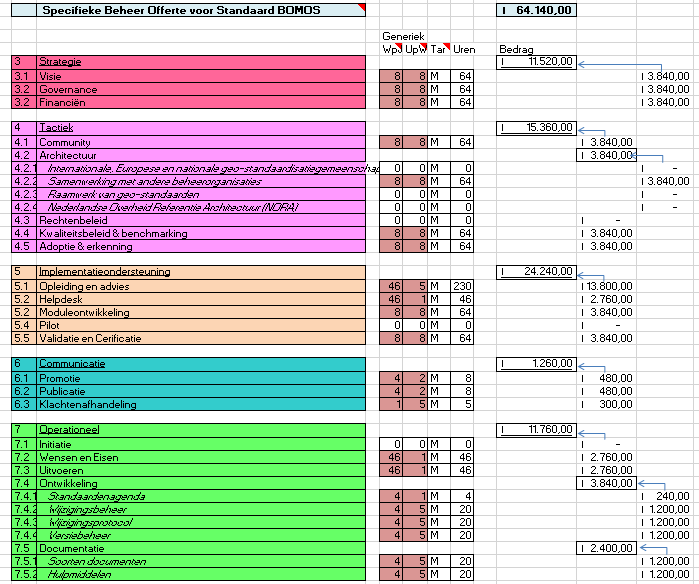

# Strategie

## Visie

1.  De rol van beheerder en adviseur wordt steeds belangrijker in de
    digitale samenleving. Aan de hand van de ervaring van verschillende
    beheerpartijen, willen we het beheer van de afdeling stelsels en
    standaarden nog effectiever kunnen inrichten en daarmee het
    draagvlak en de adoptie van de standaarden verhogen. Nog een
    belangrijke redenen is om interoperabiliteit na te streven om zo
    effectiviteit en efficiency in het samenwerken te realiseren met
    bijvoorbeeld beheerorganisatie, toeleveranciers en klanten in de
    keten. Drie concrete zaken voor de doorontwikkeling van BOMOS: Een
    nieuwe versie uitbrengen van BOMOS met nieuwe inzichten en een
    bredere scope dan de huidige versie (de methode wordt in de nieuwe
    versie bijvoorbeeld ook toegepast op stelsels)

2.  We willen BOMOS de basis maken van ons standaardenbeheer.
    Bijvoorbeeld de beheerplannen en governance van standaarden
    beschrijven volgens BOMOS, alsmede offertes voor eventuele nieuwe
    standaarden om zo meer uniformiteit aan te brengen in het beheer van
    de standaarden van onze afdeling. Dit verhoogd de kwaliteit van onze
    processen en documenten en maakt dat we als team sneller en
    flexibeler kunnen reageren op verzoeken om nieuwe standaarden in
    beheer te nemen.

3.  We willen onze kennis delen met andere organisaties, die ook
    standaarden of stelsels beheren, en met hen kennis uitwisselen. Dit
    is gunstig bij het blijven actualiseren van de BOMOS.

## Governance

BOMOS is het Beheer- en OntwikkelModel voor Open Standaarden. Het is een
instrument dat helpt bij de inrichting van het beheer van open
standaarden. Dit maakt BOMOS als het ware een standaard voor het beheren
van standaarden. BOMOS bestaat uit een bundeling van best practices en
voorbeelden van goed standaardenbeheer. Het is ontwikkeld door de
BOMOS-community en voor iedereen vrij te gebruiken.

De governance, bestuurlijke organisatie en besluitvorming voor BOMOS
wordt momenteel ingericht. Samenwerking met andere
standaardisatieorganisaties wordt onderdeel van de governance.

Bij het beheer van een open standaard hoort een open governance en een
open procedure voor belanghebbenden om te kunnen participeren in het
beheer. Logius, afdeling Standaarden neemt hierin de rol van
onafhankelijke, duurzame beheerpartij en facilitator. Bij het beheer van
BOMOS worden verschillende gremia onderscheiden die gezamenlijk
invulling geven aan de governance op de standaard:

1.  ***Uitvoeringsorganisatie (Uitvoering Groep - UG) Operationeel***

Het is een Operationeel Overleg met periodieke bijeenkomsten *(1 x per
maand)* waarbij de vragen en doorontwikkel wensen m.b.t. BOMOS worden
doorgenomen, geprioriteerd en worden uitgewerkt. Daarnaast wordt door de
leden de releaseplanning en de roadmap opgesteld en voorgelegd aan het
AG.

2.  ***Adviesorgaan en Klankbordgroep BOMOS (Advies Groep - AG)
    Tactisch***

Het is een Technisch Overleg met periodieke bijeenkomsten *(1 x per
kwartaal)* waarbij de vragen en doorontwikkel wensen m.b.t. BOMOS worden
doorgenomen, geprioriteerd en worden uitgewerkt. Dit gremium is
verantwoordelijk voor het vaststellen van de doorontwikkel-roadmap, het
vaststellen van releases van de standaard en dient als het voorportaal
van het strategisch/besluitvormende gremium.

3.  ***Directie Digitale Samenleving (Bestuur groep - BG) Strategisch***

Dit is het hoogst ambtelijke gremium dat besluit over major releases van
de standaard, het beheermodel van de standaard en externe publicaties
over releases en van het standaardenbeleid. Het BG overleg BOMOS is
momenteel nog niet actief, waardoor de UG bij wijzigingen aan de
standaard, de nieuwe versie voorlegt aan het AG voor het borgen van een
zo breed mogelijke afstemming met verschillende belanghebbenden.

N.B. De definitieve invulling van de strategische laag
wordt Q1 2023 duidelijk.

4.  ***BOMOS Community (Advies Groep - AG) operationeel***

Dit is het meest operationele gremium waarin iedere
belangstellende/belanghebbende vragen kan stellen, advies kan geven en
suggesties kan doen voor de doorontwikkeling van BOMOS. Deelname
aan de Community is vrij voor eenieder die een belang heeft bij de
standaard (overheid, wetenschap en markt ) Dergelijke vragen en
suggesties worden door Logius verzameld en voorgelegd aan het UG en AO.

### Organisatiestructuur

Voor BOMOS is er nog geen organisatiestructuur. Momenteel
wordt hier aan gewerkt, de organisatiestructuur in het figuur hieronder wordt momenteel 
onderzocht. Bij het beschrijven en borgen van dit beheerdocument worden
alle activiteiten die nodig zijn voor het beheer van BOMOS onderzocht en
uitgewerkt. Dit beheerdocument zal voor review en officiële goedkeuring
worden aangeboden door de uitvoeringsorganisatie (afdeling Standaarden)
aan het bestuur en adviesorgaan BOMOS.

Het voorstel is om de organisatiestructuur met een aantal beheerorganisaties te formeren

Bestuur groep:

-   Directie Digitale Samenleving
-   Logius afdeling Standaarden
-   Logius afdeling Portfolio
-   Bureau Forum Standaardisatie

Deelnemers Adviesorgaan/klankboordgroep:

-   Kadaster
-   Geonovum
-   Directie Digitale Samenleving
-   KOOP
-   TNO
-   Bureau Forum Standaardisatie
-   Informatie Huis Water
-   RIONED
-   Logius afdeling Stelsels
-   Logius afdeling Standaarden

Uitvoeringsgroep

-   Logius afdeling Standaarden
-   Logius afdeling Stelsels

De BOMOS Community is geen vast gremium, dit kunnen verschillende
beheersorganisaties zijn die deel willen nemen aan de BOMOS Community.
Alle beheer organisaties mogen hierin mee participeren.

### Besluitvorming

Het huishoudelijk regelement en de besluitvormingsprocessen van de governance
zijn beschreven. In deze beschrijving is duidelijk welk gremium over
welke onderwerpen gaat. Voor iedereen moet helder zijn op welke manier,
binnen welk tijdskader en door wie beslissingen worden genomen. Dit
geldt zowel voor de meer strategische besluiten als voor de operationele
afstemming. Voor elk onderdeel van de governance moet worden beschreven
hoe de besluitvorming is ingericht. Daarbij is alleen meerderheid of
consensus besluitvorming toegestaan. Waarbij aangegeven kan worden of er
meerdere stemmingsronden mogelijk zijn.

Voor het beheer van BOMOS is nog geen structureel financieel budget zoals andere
standaarden of stelsels van Logius beheerd worden. Om die reden is er
ook nog geen strategisch beraad ingesteld dat verantwoordelijk is voor
het meerjarenplan en roadmap die als standaardisatieagenda fungeert voor
de inhoudelijke visie over de richting van de ontwikkeling van BOMOS.
Een eigen structureel financieel budget ligt hieraan ten grondslag. Een duidelijke visie en
een financieel meerjarenplan voor het beheer en de ontwikkeling van
BOMOS is noodzakelijk. Momenteel wordt dit punt besproken met de
Directie Digitale Samenleving van het Ministerie van Binnenlandse zaken
en Koninkrijksrelaties en met het Bureau Forum Standaardisatie. De
kosten voor het beheer van de standaard zijn verder in het document
inzichtelijk gemaakt. Genoemde zaken vormen tot op heden geen
belemmering voor de doorontwikkeling en het inrichten van een beheer
organisatie voor BOMOS. Om het beheer en de doorontwikkeling tot stand
te brengen worden de activiteiten die daaruit voortkomen projectmatig
aangepakt en de kosten die hieruit voortkomen worden momenteel uit een
algemeen Logius budget benut. Binnen dit project zal het beheer van
BOMOS en doorontwikkeling met de daarbij behorende activiteiten in kaart
worden gebracht en geborgd.

Het Logius adviesorgaan bestaat uit vertegenwoordigers van publieke
organisaties, bestaande uit twee standaardisatie specialisten en een
aantal adviseurs. De leden werken in verschillende beheerorganisaties
van het Kadaster tot de afdeling standaarden en stelsels van Logius. Het
adviesorgaan adviseert het bestuur over de inhoud en prioriteiten voor
het basisprogramma, het beheer van BOMOS. Voor het basisprogramma, het
beheer van BOMOS, treedt het bestuur, Directie Digitale Samenleving op
als stuurgroep. Het bestuur Directie Digitale Samenleving beoordeelt en
beslist over wijzigingsvoorstellen en stelt een nieuwe (versie) van
BOMOS vast die bij Logius is in beheer is. Het adviesorgaan is
aanspreekpunt voor klachten over het beheer van BOMOS door Logius. In de
werkgroepen wordt inhoudelijk en praktijkgerichte kennis uitgewisseld,
de samenwerking met andere standaardisatieorganisaties is een belangrijk
onderdeel voor de doorontwikkeling en beheer van BOMOS.

### Sturing strategisch

Er is transparante besturing op strategisch niveau aanwezig die past bij
de ambities van de standaard.

Het operationeel beheer van BOMOS wordt uitgevoerd door de
beheerorganisatie Logius. Er is een BOMOS community verdeeld in drie
lagen met bijbehorende beraden waarin afvaardigingen van deelnemers en
dienstverleners van de beheerorganisaties zitting hebben:

-   **Strategisch niveau** - Bestuur Directie Digitale Samenleving van
    het Ministerie van Binnenlandse Zaken en Koninklijkrelacties, Het
    Bureau Forum Standaardisatie en het Adviesorgaan BOMOS. Het
    Adviesorgaan BOMOS heeft ook een formele rol op strategisch niveau
    en is aanwezig om het bestuur kennis inhoudelijk te ondersteunen.

-   **Tactisch niveau** - Bestuur Directie Digitale Samenleving van het
    Ministerie van Binnenlandse Zaken en Koninklijkrelacties, Het Bureau
    Forum Standaardisatie en het Adviesorgaan. Het Adviesorgaan BOMOS
    heeft ook een formele rol op strategisch niveau en is aanwezig om
    het bestuur kennis inhoudelijk te ondersteunen.

-   **Operationeel niveau**- Adviesorgaan BOMOS, Uitvoeringsorganisatie
    Afdeling Standaarden, Adviesorgaan/klankboord BOMOS en BOMOS
    Community welke bestaan uit deelnemers van de beheersorganisaties.

### Stakeholders-betrokkenheid

Het is duidelijk hoe stakeholders betrokken worden en hoe ze mee kunnen
participeren en wat hun rol daarbij is. Relevante typen stakeholders
moeten een plek kunnen krijgen ergens in de gekozen structuur van het
stelsel, en niet principieel worden buitengesloten. Dat wil niet zeggen
dat elk type stakeholder per definitie dezelfde rechten en plichten
heeft. Zorg daarnaast ervoor dat binnen die groepen vooral organisaties
aangesloten zijn die zich committeren aan de doelstellingen van de
standaard.

Betrokkenheid van de Community bij de verdere ontwikkeling van de
standaard is voor het gebruik en de draagvlak ervan van groot belang.
Voor de standaard geldt dat geen onderscheid wordt gemaakt tussen
publieke en private organisaties en bijvoorbeeld kennisinstellingen. Zij
vormen samen de community. Aan de inspraak in het wijzigingsproces zijn
voor hen geen kosten verbonden. Logius informeert en betrekt de
community via de website en de verschillende nieuwsbrieven. Uit de
community worden de werkgroepen gevormd op het moment dat dit benodigd
is. De vergaderdata en verslagen van deze werkgroepen zijn beschikbaar
voor een ieder via
[BOMOS Fundament](https://github.com/Logius-standaarden/BOMOS-Fundament)
en [BOMOS Verdieping](https://github.com/Logius-standaarden/BOMOS-Verdieping).
Inschrijven voor bijeenkomsten is mogelijk via xxxxx (via toekomstige
weblink)

### Belangenorganisaties-betrokkenheid

Betrokkenheid van belangenorganisaties is van cruciaal belang vanwege het feit dat ze vaak
optimaal hun achterban kunnen bereiken en vertegenwoordigen. Alle relevante belangenorganisaties 
moeten dan ook betrokken zijn, en waar mogelijk moeten partnerschappen worden gesloten op het gebied van communicatie

De afdeling Standaarden van Logius werkt samen met andere
beheerorganisaties, dit kunnen verschillende type beheerorganisaties
zijn, hierin wordt geen onderscheid gemaakt. Een brede samenwerking en
kennisgebied is in het belang van de standaard maar ook in het belang
van de beheerorganisatie zelf. Daarom zorgt de Uitvoeringsorganisatie
(afdeling Standaarden) en het Adviesorgaan BOMOS ervoor dat
belanghebbende beheerorganisaties worden betrokken bij verschillende
activiteiten en overlegvormen. De activiteiten of overleggen kunnen
workshops zijn, werkgroep overleggen voor wijzigingen of
klankboardgroepen voor het uitwisselen van kennis.

### Opdracht werkgroepen

Zowel de opdracht van de werkgroep als de wijze waarop over de
resultaten en uitdagingen gerapporteerd wordt zijn beschreven.

Nieuwe ideeën of wijzigingsverzoeken komen binnen bij de
Uitvoeringsorganisatie (afdeling Standaarden) van Logius via
[BOMOS Fundament](https://github.com/Logius-standaarden/BOMOS-Fundament)
en [BOMOS Verdieping](https://github.com/Logius-standaarden/BOMOS-Verdieping),
of via contacten in het netwerk van de medewerkers van de afdeling
Standaarden of Stelsels. Zodra een nieuw initiatief zich aandient, in de
vorm van een opdracht, zorgt de afdeling Standaarden ervoor dat het
adviesorgaan hiervan op de hoogte wordt gesteld en er een werkgroep
wordt opgezet.

## Structureel financieel model

Jaarlijks wordt bepaald welk deel van de basisfinanciering besteed wordt
aan het standaardisatiewerk en daarmee het beheer van de standaarden.
Over de besteding van de basisfinanciering leggen wij verantwoording af
aan de Directie Digitale Samenleving van het Ministerie van Binnenlandse
Zaken en Koninklijk relaties en via het jaarverslag.

### Behoefteanalyse

De structurele financiering is gebaseerd op een grondige behoefte
analyse zoals hieronder in kaart gebracht, voor het beheren en
doorontwikkelen van de standaard.

